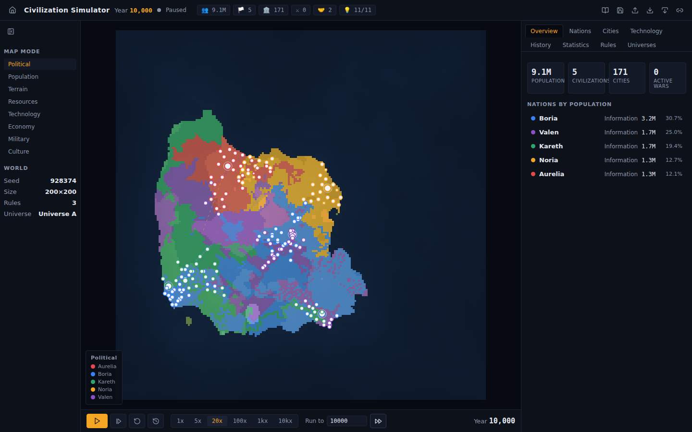

# Civilization Simulator · 文明演化模拟器

> **Build the rules. Run the world. Watch history emerge.**
> **制定规则，运转世界，见证历史涌现。**

**English** | [中文说明](#中文说明)

A pure-frontend civilization evolution sandbox with a fully bilingual (English / 中文) interface — even the generated historical events and the world-history narrative are bilingual. You are not a player — you are the observer. Define a world, define a handful of civilizations and simple rules, press start, and watch thousands of years of emergent history: migration, cities, technology, trade, diplomacy, wars, empires, civil wars, extinctions — and new peoples rising from the ruins.



## Quick start

```bash
npm install
npm run dev      # open http://localhost:5173
```

Other commands:

```bash
npm test         # vitest unit tests (determinism, replay, war termination, serialization…)
npm run build    # typecheck + production build
npm run lint     # eslint (bans Math.random / Date.now inside the engine)
npm run preview  # serve the production build
```

First run: click **Explore Example World** — a 200×200 world with 5 civilizations starts simulating immediately. Type `10000` into "Run to" and press ⏩ to fast-forward ten thousand years in a few seconds.

## What you can do

- Create worlds: seed, map size (120–600), continent count (auto or 1–6 separated landmasses with real oceans between), ocean level, resource richness, disaster frequency
- Create 2–20 civilizations with personality sliders (Aggression, Trade, Science, Migration, Expansion, Diplomacy, Birth Rate, Risk Taking) and starting technologies
- Build IF/THEN rules with a visual Rule Builder (no code), or load templates (Peaceful, Militaristic, Merchant, Scientific, Nomadic, …)
- Control time: pause / play / step / 1x–10,000x / run-to-year / reset
- **Replay**: re-run history from Year 0 — the result is bit-for-bit identical
- **Parallel universes**: branch the current world (same or different seed / rules), run both, and compare populations, cities, wars, and tech side by side
- Inspect everything: tiles, nations (with history charts and relations), cities, the tech tree, an event timeline, and world statistics
- Save/load (browser storage), export/import JSON configs, and share a URL that reconstructs the identical world anywhere
- Read the auto-generated **World History** narrative and export it as text
- **Play god**: 9 divine intervention tools — hurl meteors, unleash plagues, split the earth, bless or blight the land, will new civilizations into being, spark golden ages, incite wars, force peace. Interventions are recorded into the world's recipe and replay deterministically — branch a universe to compare history *with and without* your meddling
- **Achievements**: 16 observer milestones (witness the first war, an empire's rise, an extinction, reach AI, survive 10,000 years, wield the hand of god…), persisted across worlds
- **Historic-moment banners**: major events (wars, collapses, empires, divine acts) slide in over the map — click to jump there, or enable auto-pause on historic events
- **Faith & the observer**: doctrines crystallize out of each civilization's lived history (harvest cults, storm cults, atheist "Silent Sky" scholars…) and permanently reshape their character; nations **pray to you** when starving, plagued, or losing wars — answer within a generation and devotion soars, stay silent and temples empty; the world's prophets **name you** from your deeds (The Star-Hurler, The Gardener, The Silent One…); fallen nations leave clickable **ruins with epitaphs**, and philosophers ask questions their history taught them to ask
- **Technology becomes things, not buffs**: key techs manifest physically (labelled on the tech tree). Agriculture → tilled furrow fields ring every settlement; Wheel → dirt wagon-tracks; Roads → paved stone highways; Internal Combustion → asphalt roads with two-lane car traffic (headlights, tail-lights); Flight → aircraft with contrails cruising between cities (and war missiles on the globe); Masonry → city walls; Industry → factory chimneys and exhausting mines; Electricity → electric night lights; Spaceflight → satellites and ships in orbit; Transcendence → the Gate
- **Street-level living world (LOD)**: zoom in and the map stops being colored blobs — cities grow procedural buildings that evolve with technology (huts → stone walls → industrial chimneys → glowing skyscrapers, capitals get walls, a golden hall and a banner), tiny animated inhabitants wander the streets, golden caravans travel the trade routes, soldiers clash along burning front lines, forests become individual trees and mountains get snowcaps; meteor strikes now fall from the sky with a blast flash; the terrain is hillshaded (NW light) and buildings are extruded in 2.5D — lit facades, shadowed side walls, rooftops, and ground shadows under every building, tree, and person
- **Night-lights map & chronicle mode**: a "civilization lights" view where city glow shifts from firelight to electric white as technology advances, crisp political borders, burning war-front pixels, and a cinematic chronicle mode where the camera drifts to wherever history is happening
- **Finite resources**: mines run dry under industrial extraction, over-logged forests turn to farmland, soil tires under the plough and rests when abandoned — scarcity, not abundance, drives migration and war (toggle: `finiteResources`, on by default)
- **The way out of a finite world**: the tech tree now ends beyond AI — **Spaceflight** unlocks orbital mining (the planet is finite, the sky is not), and **Dimensional Transcendence** opens a Gate: the civilization emigrates over generations and finally *leaves the world* — not extinction but ascension, leaving golden monuments, empty cities, and room for new peoples to rise from their ruins
- **Planet view (3D)**: one click turns the world into a real Three.js globe — your continents on a sphere with atmosphere rim, starfield, a day/night terminator sweeping the surface, and civilization lights glowing on the night side (color shifts firelight→electric with technology). Textures repaint live from the running simulation; drag to rotate, scroll to zoom. Loaded lazily so the 2D analysis app pays no bundle cost
- **Research Lab** (the instrument): Monte Carlo batches (same config × N deterministic seeds, run on a parallel worker pool → mean/σ/median tables and a population mean±σ band) and parameter sweeps (step one parameter — any trait for all civs, disasters, resources, ocean level — with several seeds per step → outcome-vs-parameter curves with error bands), plus CSV/JSON export. Experiments are themselves reproducible: every seed is derived from the recipe
- **Scenario challenges**: six win/fail scripts — keep every nation alive for 5,000 years without touching anything, set a peaceful world ablaze with only 3 interventions, reach AI before year 3,000, witness an empire rise and fall as a purely silent god…
- **AI rulers (LLM-governed nations)**: flip the Cpu toggle on any nation and a language model takes its throne. Every ~40 years (sooner in war or disaster) its council convenes: the app sends the model the nation's full dossier plus a constrained action menu — redirect research, declare war, sue for peace, send embassies, reform national character — and the model answers with ONE strict-JSON decision plus its reasoning. The engine is the referee: every decision is validated against the rules (tech prerequisites, borders/navy for war, trait bounds), and an illegal or garbled answer simply falls back to default behaviour. Decisions are recorded into the world's recipe exactly like divine interventions, the stated reasoning is written into the chronicle ("The council's records state: …"), and replays reproduce the same history bit-for-bit without ever calling the model again. Mix AI-ruled and rule-driven nations in one world and watch them collide
- **AI Analyst (bring your own model)**: every nation panel has a Bot button that opens a chat with an LLM historian. The app compiles a compact numeric dossier — traits, population/territory/tech/economy/military trajectories, the tech path in unlock order with years, every war with scores, the chronicle, the epitaph, world context — injects it as the system prompt, and streams the answer. Ask "why did this civilization die?" and get a causal chain cited with years and numbers. Works with any OpenAI-compatible endpoint: local **Ollama** by default (free, private, no key), or free cloud tiers (Zhipu GLM-4-Flash, SiliconFlow Qwen, Groq) with your own key — the key never leaves your browser, requests go straight from browser to provider, no middle server

## Architecture

```
src/
  simulation/          Pure TypeScript engine — no React, no DOM
    types.ts           All shared types (Tile, Civilization, City, WorldEvent, WorldConfig…)
    Random.ts          SeededRandom (xmur3 + sfc32) — the only source of randomness
    Terrain.ts         Deterministic map generation (fBm value noise, continents, rivers, resources)
    World.ts           World creation + core mutations (claim/transfer tiles, events, yields cache)
    Population.ts      Macro population model (logistic growth, famine, carrying capacity)
    Migration.ts       Population flows toward better land; border crossings
    City.ts            Urbanization, city founding and growth (village→town→city→capital)
    Economy.ts         Economy/happiness/stability/culture/military, research, expansion
    Technology.ts      Linear 11-tech tree with multiplicative effects
    Diplomacy.ts       Relations (−100…+100), alliances, trade routes
    Warfare.ts         War declaration, yearly resolution, conquest, peace, extinction
    Collapse.ts        Empires, civil wars/splits, wilderness rebirth
    Events.ts          Seeded natural disasters (drought, plague, meteor…)
    Rules.ts           The rule engine (metrics → conditions → behavioral modifiers)
    engine.ts          simulateYear(): the fixed phase order
    snapshot.ts        Builds the render payload sent to the UI
    presets.ts         Rule templates + world presets
  worker/
    simulation.worker.ts  Owns WorldState; runs the tick loop off the main thread
    protocol.ts           Typed messages between UI and worker
  state/
    simulatorStore.ts  Zustand store: universes, snapshots, selection, view state
  components/          React UI (landing, setup wizard, canvas, inspector, charts…)
  utils/               serialization (config JSON + share URLs), history narrative, formatting
```

**The engine never imports React.** React talks to a Web Worker through a small message protocol; the worker owns the entire `WorldState` and posts lightweight `Snapshot`s (typed arrays transferred, long series decimated) at ~11 Hz regardless of simulation speed. The main thread only does UI, canvas rendering, and interaction.

### Deterministic simulation

Determinism is a hard guarantee, enforced three ways:

1. **A single seeded PRNG** (`SeededRandom`: xmur3 string hash → sfc32). `Math.random()` and `Date.now()` are banned from `src/simulation/**` and `src/worker/**` by an ESLint rule. (The landing page's decorative particle background uses `Math.random` — it never touches the simulation.)
2. **A fresh RNG per simulated year**, derived as `hash(seed + "::year::" + year)`. No RNG state is carried across years, so a world resumed at year N continues exactly like a world run straight through — which is what makes Replay and universe branching trivially consistent.
3. **A fixed phase order** in `simulateYear()`: rules → disasters → food → population → migration → cities → research → economy → trade → diplomacy → war declarations → war resolution → expansion → empire/collapse → extinction/rebirth → statistics. Iteration order over civilizations is always index order; no object-key iteration is relied on.

Same seed + same config + same engine version ⇒ identical history, verified by unit tests and by the in-app Replay button.

### The rule system

A rule is data, not code:

```
IF   Food Per Capita < 0.5
AND  Population Density > 80
THEN Increase Migration +30       (for all civilizations, or one)
```

Every simulated year, each enabled rule is evaluated per civilization against 14 metrics (population, food per capita, stability, neighbor strength, year, climate, …). Matching rules accumulate into that year's `RuleModifiers` — probability and weight nudges (migration drive, war probability, research multiplier, city-founding threshold…). Rules **never** dictate outcomes directly; they tilt the odds, and history emerges from the interaction. Editing rules mid-run deterministically re-simulates history from Year 0 under the new rules and fast-forwards to the current year.

### Performance model

- Map storage is structure-of-arrays (`Uint8Array`/`Float32Array`/`Int16Array`), not 40,000 objects.
- Per-civ resource yields are cached and updated incrementally when tiles change hands; the only O(tiles) work per year is one population pass.
- Population is a macro model (aggregate per civ, distributed per tile with a yearly renormalization that keeps map and aggregate consistent) — no per-person agents.
- 10,000 years on a 200×200 map with 5+ civilizations simulates in **~3–5 seconds** inside the worker; the UI stays at 60 FPS throughout.
- Snapshots transfer `ArrayBuffer`s and decimate all time series before posting.

### Serialization & sharing

Only the *recipe* is ever serialized: seed + world config + civilization configs + rules + engine version (~a few KB). Saves, JSON exports, and share URLs (`?seed=…&config=<base64url>`) all reconstruct the world by re-running the deterministic simulation — imported configs are validated and clamped field-by-field, so corrupt input degrades gracefully instead of crashing.

## Tests

`src/simulation/__tests__/` covers: PRNG determinism, identical worlds from identical configs, seed divergence, exact replay equality (including event years), population sanity over 2,000 years (no NaN/∞/negatives), war termination (hard cap well under 50 years), city founding/expansion, splits & extinctions occurring in hostile worlds, config round-tripping to identical simulations, config validation/clamping, and rules measurably changing history. Plus a 10,000-year smoke/performance run.

## The technology web · 人类科技网

47 real human technologies in a dependency DAG — agriculture, pottery, the wheel, writing, currency, philosophy, medicine, navigation, printing, gunpowder, banking, the scientific method, steam engines, railroads, vaccination, electricity, flight, antibiotics, computing, the internet, genetic engineering, AI, fusion, spaceflight, transcendence… Civilizations do **not** walk a fixed ladder: each one picks its next research by **weighted choice biased by geography** (coastline share → sailing & navigation; mountains → mining & metallurgy; river valleys → irrigation; population density → medicine), **traits and doctrine** (the Iron Creed rushes gunpowder, the Golden Scale rushes banking, the Silent Sky rushes universities). Progress is paced to real history — the neolithic package takes centuries, the classical world millennia, and acceleration only arrives with printing and the scientific method (a balanced world reaches AI around year ~6,000; war-torn worlds may never). Two nations in the same world grow visibly different trees — inspect any nation's personal path in the Technology tab. Wars are lethal: a dominant, aggressive victor refuses peace and marches to total conquest, brutal conquerors raze cities to rubble, losing nations bleed harder, and exhausted pairs observe a decades-long truce before fighting again. Naval powers can wage overseas conquest once they master navigation — and the **Age of Sail** is real: coastal nations under population pressure load settler ships and colonize distant unclaimed shores (sailing = short range, navigation = open ocean), so empty continents become new worlds to race for.

47 项真实人类科技构成依赖网络。文明**不走固定阶梯**：每个文明按**地理**（海岸线→帆船航海，山地→采矿冶金，河谷→灌溉，人口密度→医术）与**性格信条**（铁血信条抢火药、金秤信条抢银行、寂空之思抢大学）加权选择下一项研究——科技节奏对齐真实历史比例——新石器包耗时数百年、古典世界数千年、加速只在印刷术与科学方法之后到来（均衡世界约 6000 年抵达 AI，战乱世界可能永远到不了）。同一世界里两个国家的科技树长得截然不同。科技页可查看每个国家的专属路径；战争是致命的：占尽优势且好战的胜利者会拒绝议和、直至灭国，残暴的征服者会屠城毁邑，战败方伤亡更重，精疲力竭的双方会有数十年停战期。掌握航海的海权国家可发动跨洋征服——而且**大航海时代**是真实发生的：沿海国家在人口压力下装载殖民船，跨海在无主海岸登陆建立殖民地（帆船=近海航程，航海=远洋），空大陆成为列强竞逐的新世界。

## Scientific models · 科学模型

The physical world is grounded in real published models, each cheap enough for 10,000-year runs:

| Layer | Model | Source |
|---|---|---|
| Continents & mountains | Plate-tectonics-lite: drift vectors, uplift at convergent boundaries, island arcs at sea | procedural adaptation of plate kinematics |
| Temperature | Latitude insolation + 6.5°C/km lapse rate | standard atmosphere |
| Precipitation | Hadley-cell wind bands (trades / westerlies / polar easterlies), ocean evaporation, moisture advection, orographic rain & rain shadow, evapotranspiration recycling | reduced-order circulation |
| Biomes | Whittaker diagram (temperature × precipitation) | Whittaker 1975 |
| Land fertility | Miami NPP model: NPP = min(3000/(1+e^(1.315−0.119T)), 3000(1−e^(−0.000664P))) | Lieth 1975 |
| Warming | ΔT = 3.0 · log₂(CO₂/280) — logarithmic radiative forcing, IPCC central sensitivity | Arrhenius / IPCC |
| Consequences | Biome drift under ΔT, ice-melt sea-level rise drowning coasts & cities | energy-balance reasoning |

工业文明燃烧化石燃料排放 CO₂（信息时代技术逐步脱碳），大气浓度按源汇平衡演化，升温按真实对数辐射强迫计算，随后生物群系漂移（冻原绿化、荒漠扩张）、海面上升淹没沿海城市——全部确定性、全部可在统计页看到 CO₂ 与升温曲线。

## Notes

- First version intentionally avoids WebGPU, backends, LLMs, and per-agent simulation — the point is *simple rules, deterministic simulation, emergent history, and a readable map*.
- The event log is capped (~8,000 entries) by dropping low-importance old events; major history is always kept.
- If all civilizations die, the world keeps simulating — scattered survivors in the wilderness can found new nations ("dark age → rebirth"), so deep time stays interesting.
- **Bilingual by design**: UI chrome is translated through a lightweight dictionary (`src/i18n/`), while simulation-generated event text is stored *bilingually inside each event at generation time* — so switching the display language never touches determinism, and a replayed history is identical in both languages.

---

# 中文说明

一个纯前端的文明演化沙盒，界面完整支持**中英双语**（右上角一键切换，包括模拟生成的历史事件与世界史叙事）。你不是玩家，而是观察者：定义一个世界、几个文明和一组简单规则，按下开始，然后看数千年的历史自行涌现 —— 迁徙、城市、科技、贸易、外交、战争、帝国、内战、灭亡，以及废墟之上崛起的新民族。

## 快速开始

```bash
npm install
npm run dev      # 打开 http://localhost:5173
```

其他命令：`npm test`（单元测试）· `npm run build`（类型检查 + 生产构建）· `npm run lint`。

第一次使用：点击**探索示例世界** —— 一个 200×200、5 个文明的世界立即开始模拟。在"运行至"输入 `10000` 并按 ⏩，几秒内快进一万年。

## 你可以做什么

- 创建世界：种子、地图尺寸（120–600）、大陆数量（自动或 1–6 块被真正海洋分隔的大陆）、海洋比例、资源丰富度、灾难频率
- 创建 2–20 个文明，用滑杆定义性格（侵略、贸易、科学、迁徙、扩张、外交、生育率、冒险精神）与初始科技
- 用可视化规则编辑器搭建 IF/THEN 规则（无需写代码），或加载模板（和平、军国、重商、科研、游牧……）
- 控制时间：暂停 / 播放 / 单步 / 1x–10,000x / 运行至指定年份 / 重置
- **重放（Replay）**：从元年重演历史 —— 结果逐比特一致
- **平行宇宙**：分支当前世界（同种子或改规则/种子），并排对比人口、城市、战争、科技
- 检视一切：地块、国家（历史曲线与外交关系）、城市、科技树、事件时间线、世界统计
- 保存/读取（浏览器存储）、导出/导入 JSON 配置、复制分享链接（任何地方打开都能重现同一段历史）
- 阅读自动生成的**世界历史**叙事并导出为文本
- **扮演上帝**：9 种神之手干预工具 —— 掷陨星、放瘟疫、裂大地、赐福/枯萎土地、凭空创生文明、开启黄金时代、挑动战争、强制和平。干预会记入世界配方并确定性重放 —— 分支一个宇宙，对比"有你插手"和"没你插手"的两段历史
- **成就系统**：16 个观察者里程碑（见证第一场战争、帝国崛起、文明灭绝、抵达 AI、模拟一万年、初次动用神之手……），跨世界持久保存
- **历史时刻横幅**：重大事件（战争、灭亡、帝国、神迹）滑入地图上方 —— 点击即可跳转现场，也可开启"历史时刻自动暂停"
- **信仰与观察者**：信条从每个文明亲历的历史中结晶（丰饶之道、风暴崇拜、无神论的"寂空之思"……）并永久重塑其民族性格；国家会在饥荒、瘟疫、战败时**向你祈祷** —— 一代人之内回应则虔诚高涨，保持沉默则神庙冷清；世界的先知会依据你的所作所为**为你命名**（掷星者、播绿者、沉默者……）；亡国留下可点击的**废墟与墓志铭**，思想家会问出被自身历史塑造的问题
- **科技解锁的是实体，不是数值**：关键科技会在世界里长出真实的东西（科技树上有标注）。农业 → 聚落四周出现条垄耕地；车轮 → 城市间的土路；道路 → 石板大道；内燃机 → 柏油公路上双向车流（车灯、尾灯俱全）；飞行 → 城市间的航班拉着尾迹飞行（战时导弹上 3D 星球）；石作 → 城墙；工业 → 工厂烟囱与枯竭的矿脉；电力 → 城市夜灯变电光；星际航行 → 卫星与飞船入轨；维度跃迁 → 「门」
- **街景级活世界（LOD）**：放大地图，色块世界会"落地"——城市长出随科技演化的程序化建筑群（茅屋 → 石墙 → 工业烟囱 → 亮窗高楼，首都有城墙、金顶大殿与旗帜），街道上有走动的小人，商路上有金色商队，战线上有厮杀的士兵与刀光，森林变成一棵棵树、山地有雪峰；陨石会真正从天而降并爆出冲击闪光；地形带西北光源的山体光照（hillshading），建筑以 2.5D 挤出——受光正面、背光侧墙、屋顶面，且每栋建筑、每棵树、每个小人脚下都有投影
- **文明夜灯与编年史模式**：城市光辉随科技从篝火橙演进为电力蓝白的"夜晚地球"视图、清晰国界描边、燃烧的战线像素、镜头自动飘向历史现场的电影化编年史模式
- **有限资源**：矿脉会在工业开采下枯竭、过度砍伐的森林退化为农田、重耕之地地力衰竭而休耕之地缓慢恢复——稀缺而非丰饶驱动迁徙与战争（`finiteResources` 开关，默认开启）
- **有限世界的出路**：科技树延伸到 AI 之后——**星际航行**解锁轨道采矿（行星有限，天空无限），**维度跃迁**打开一扇「门」：文明历经数代人移民，最终整体离开这个世界——不是灭亡而是升维，留下金色纪念碑、空城，和让新民族从废墟中崛起的空间
- **行星视图（3D）**：一键把世界变成真正的 Three.js 地球仪——你的大陆贴在球面上，有大气边缘光晕、星空、扫过表面的昼夜晨昏线，夜半球亮起文明灯火（光色随科技从火光变为电光）。纹理从运行中的模拟实时重绘；拖拽旋转、滚轮缩放。按需懒加载，2D 分析端零打包成本
- **研究实验室**（仪器本体）：蒙特卡洛批量（同配置 × N 个确定性种子，并行 worker 池运行 → 均值/σ/中位数统计表 + 人口均值±σ带）与参数扫描（任一参数步进——全体文明性格、灾难频率、资源、海平面——每步多种子 → 带误差带的"结果 vs 参数"曲线），支持 CSV/JSON 导出。实验本身可复现：所有种子由实验配方确定性派生
- **剧本挑战**：六个带胜负判定的剧本 —— 零干预守护所有国家活满 5000 年、只用 3 次干预点燃和平世界、3000 年前抵达 AI、以纯粹沉默之神的身份见证帝国兴亡……
- **AI 执政（大模型治国）**：在任意国家面板打开 Cpu 开关，一个大语言模型就登上了它的王座。约每 40 年（战争或灾难时提前）召开一次"朝会"：应用把该国完整档案和一份受限动作菜单发给模型——改研究方向、宣战、求和、派使团、国策改革——模型只能返回一个严格 JSON 决策外加决策理由。引擎是裁判：每个决策都要过合法性校验（科技前置、宣战需接壤或有海军、性格调整有上下限），非法或格式错误的回答自动回退到默认规则行为。决策像神之手干预一样记入世界配方，模型陈述的理由会写进编年史（"枢密院记载的理由是：……"），重放时不再调用模型也能逐比特重现同一段历史。让 AI 执政国与规则驱动国同场竞技，看它们碰撞出什么历史
- **AI 分析师（自带模型）**：每个国家面板都有一个机器人按钮，打开与"LLM 史官"的对话。应用会把该文明压缩成一份数值档案——性格、人口/领土/科技/经济/军事轨迹、按年份排列的科技解锁路径、每场战争与战争分、大事记、墓志铭、世界背景——注入系统提示词并流式返回回答。问一句"这个文明为什么消亡？"，会得到引用具体年份和数值的因果链分析。兼容任何 OpenAI 格式端点：默认本地 **Ollama**（免费、私密、无需密钥），也可用免费云端档位（智谱 GLM-4-Flash、SiliconFlow 免费 Qwen、Groq）配自己的密钥——密钥只存在你的浏览器里，请求由浏览器直连服务商，不经过任何中间服务器

## 架构与设计

- **引擎与 React 完全解耦**：`src/simulation/` 是纯 TypeScript，从不 import React；模拟运行在 Web Worker（`src/worker/`）中，主线程只负责 UI、Canvas 与交互。Worker 以约 11Hz 向 UI 发送轻量快照（typed array 传输 + 长序列抽稀），与模拟速度无关。
- **确定性模拟（硬性保证）**：唯一随机源是种子化 PRNG（xmur3 哈希 → sfc32）；ESLint 规则禁止引擎内使用 `Math.random()` / `Date.now()`。每个模拟年派生独立 RNG（`hash(seed::year::N)`），不跨年携带 RNG 状态 —— 因此从任意年份续跑与从头直跑完全一致，重放与宇宙分支天然可靠。`simulateYear()` 内部 16 个阶段的顺序固定不变。
- **规则系统**：规则是数据而非代码。每年对每个文明求值 14 种指标（人口、人均粮食、稳定度、邻国实力、年份、气候……），命中的规则累加为当年的行为倾向修正（迁徙驱动、开战概率、科研倍率、建城阈值……）。规则从不直接决定结果，只改变概率，历史从相互作用中涌现。修改规则后会在新规则下从元年确定性重演。
- **性能模型**：地图为结构化数组（`Uint8Array`/`Float32Array`），非 4 万个对象；文明资源产出增量缓存；人口为宏观聚合模型（每年一次地块归一化保证守恒）。200×200 地图上一万年在 Worker 内约 3–5 秒模拟完成，UI 全程 60 FPS。
- **序列化与分享**：只序列化"配方"（种子 + 世界/文明/规则配置 + 引擎版本，仅几 KB）。存档、JSON 导出与分享链接（`?seed=…&config=<base64url>`）全部通过重新运行确定性模拟来重建世界；导入内容逐字段校验并钳制，损坏输入优雅降级而非崩溃。
- **双语实现**：UI 文案走轻量字典（`src/i18n/`）；模拟生成的事件文本在**生成时同时写入中英两份**存入事件对象 —— 切换显示语言不触碰确定性，重放历史在两种语言下完全一致。

## 测试

`src/simulation/__tests__/` 覆盖：PRNG 确定性、同种子同配置产生逐项一致的世界、重放事件年份完全一致、2000 年人口无 NaN/∞/负数、战争必然结束（硬上限远低于 50 年）、建城与扩张、敌对世界中出现分裂与灭亡、配置导出→导入后模拟结果一致、非法配置校验与钳制、规则可测量地改变历史，外加一个一万年冒烟/性能测试。
